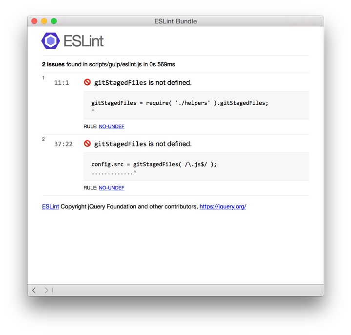
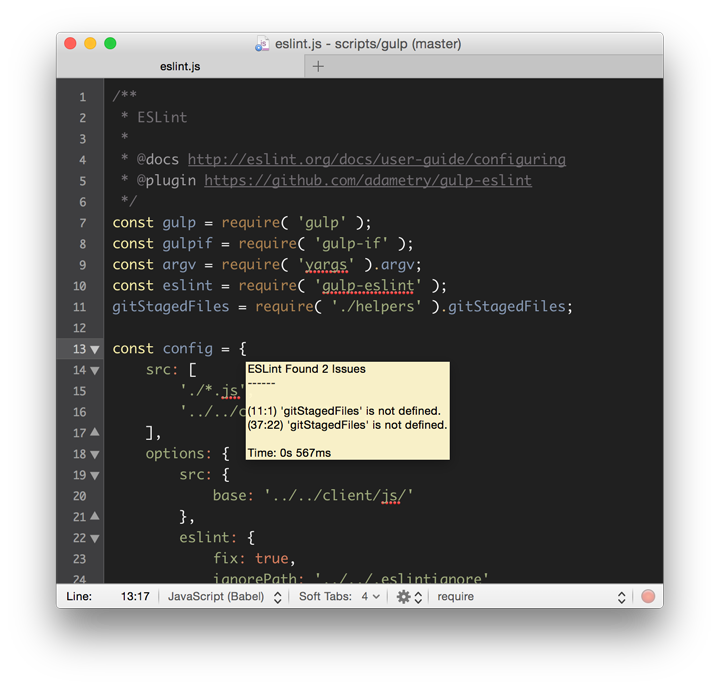

# ESLint Bundle for Textmate #

Lint your JavaScript files with [ESLint](http://eslint.org).






## Features ##

  - Uses your project's `eslint` package. This enables you to lint with the version of ESLint that each project project uses.

  - Configurable per project via `.tm_properties`.

  - Lints every time you save the current document and shows errors via an unobtrusive tooltip. No tooltip is shown for warnings.

  - Lint the current document with the shortcut `⌃L` to see expanded the view, which includes:
    - ESLint version
    - path to current document
    - issue severity ("warn" vs. "error")
    - link to documentation for rule related to reported issue
    - link to focus cursor to the line and column where to reported issue


## Requirements ##

  - [NodeJS](https://nodejs.org) v6.x.x

  - ESLint installed your project's `node_modules` directory (see `TM_eslint_path` [option](#tm_eslint_path))

  - An `.eslintrc*` file in your project's root (see #[6605](https://github.com/eslint/eslint/issues/6605))


## Commands ##

  - `⌃L`: **Lint** lints current document and shows issues in new window.

  - `⌘S`: **Lint on Save** lints current document shows issues in a tooltip.

  - `^H`: **Help** Shows `README.md` in new window.


## Options ##

TextMate will look for a `.tm_properties` file in the project's root directory and in any parent folders (up to the user’s home folder). You can use the following properties to customize ESLint.


### `TM_eslint_path` ###

  - Type: `String`
  - Default: `./node_modules/eslint`

Path to `eslint` package. Must include a "package.json" file.

Example:

```
TM_eslint_path = './path/to/node_modules/eslint'
```


### `TM_eslint_config_file` ###

  - Type: `String`
  - Default: `null`

Path to the configuration file to use.

Example:

```
TM_eslint_config_file = 'path/to/config.js'
```


### `TM_eslint_base_config_file` ###

  - Type: `String`
  - Default: `null`

Path to base configuration file. Only `*.js` or `*.json` extensions are currently supported (file is loaded using `require`, therefore `*.yaml` and files with no extension are currently supported).

Example:

```
TM_eslint_base_config = 'path/to/base/base-config.js'
```


### `TM_eslint_use_eslintrc` ###

  - Type: `Boolean`
  - Default: `true`

Set to `false` to disable use of `.eslintrc*` files.

Example:

```
TM_eslint_use_eslintrc = false
```


### `TM_eslint_fix` ###

  - Type: `Boolean`
  - Default: `false`

Output fixes source for errors and warnings that ESLint can fix. All rules in the [documentation](http://eslint.org/docs/rules) that show a wrench icon are fixable.

Example:

```
TM_eslint_eslint_fix = true
```


### `TM_eslint_ignore_path` ###

  - Type: `String`
  - Default: `null`

Use a non-default ignore file. From [Ignoring Files and Directories](http://eslint.org/docs/user-guide/configuring#ignoring-files-and-directories):

> When ESLint is run, it looks in the current working directory to find an `.eslintignore` file before determining which files to lint. If this file is found, then those preferences are applied when traversing directories. Only one `.eslintignore` file can be used at a time, so `.eslintignore` files other than the one in the current working directory will not be used.

Example:

```
TM_eslint_ignore_path = 'path/to/ignore/file'
```


### `TM_eslint_ignore_pattern` ###

  - Type: `String`
  - Default: `null`

Comma separated list of glob patterns.

Example:

```
TM_eslint_ignore_pattern = 'first/pattern, second/pattern'
```


### `TM_eslint_cwd` ###
  
  - Type: `String`
  - Default: `$TM_PROJECT_DIRECTORY`
  
Path to a directory that should be considered as the current working directory.

Example:

```
TM_eslint_cwd = 'path/to/project'
```
